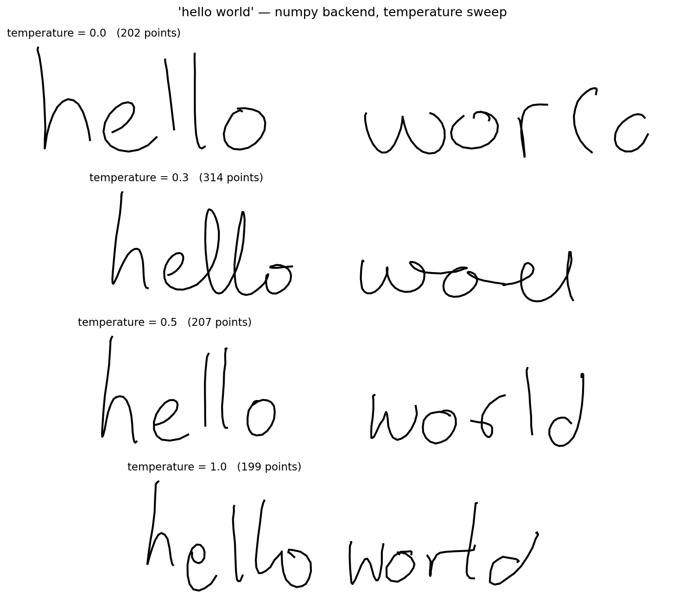
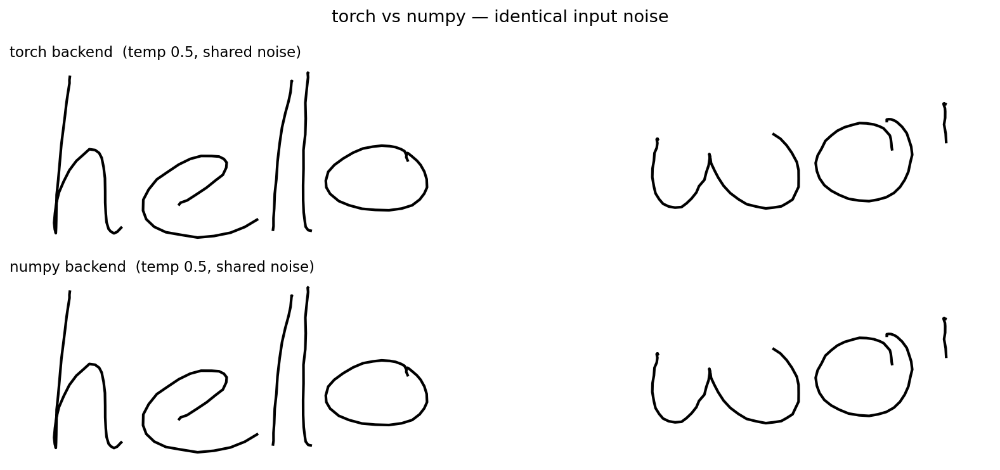

# Handwriting Synthesis

A from-scratch implementation of [Graves (2013) — *Generating Sequences With Recurrent Neural Networks*](https://arxiv.org/abs/1308.0850), trained on the IAM On-Line Handwriting Database and served as a streaming HTTP API.

You give it text. It generates realistic cursive handwriting, stroke by stroke.

---

## How it works

The model uses a **soft attention window** to align pen strokes with input characters. Three stacked LSTMs generate a mixture-density output (20 Gaussians) that models the joint distribution of pen offsets and pen-up events.

```
text: "hello world"
         ↓
   soft window (K=10 Gaussians along text axis)
         ↓
   3× stacked LSTM  (hidden size 400)
         ↓
   mixture density network (M=20)
         ↓
   pen strokes (dx, dy, pen_up)
```

The window is monotonic — κ only moves forward through the text — so the model can't cheat by re-reading characters.

---

## Samples

Temperature controls how "messy" the handwriting is (0 = deterministic, 1 = expressive).

| temp 0.0 | temp 0.3 | temp 0.5 | temp 1.0 |
|----------|----------|----------|----------|
| clean, rigid | slightly looser | natural | chaotic |



The numpy serving backend produces bit-for-bit identical output to the original PyTorch model:



---

## API

Live at: `https://handwriting-api-687921010800.europe-central2.run.app`

### Stream strokes (recommended)

```bash
curl -X POST https://handwriting-api-687921010800.europe-central2.run.app/generate/stream \
  -H "Content-Type: application/json" \
  -d '{"text": "hello world", "temperature": 0.5}'
```

Returns NDJSON — one `{"point": [dx, dy, pen_up]}` per pen step, streamed live. Use this to animate the handwriting as it generates rather than waiting for the full result.

### JSON response

```bash
curl -X POST https://handwriting-api-687921010800.europe-central2.run.app/generate \
  -H "Content-Type: application/json" \
  -d '{"text": "hello world", "temperature": 0.5}'
```

### Other endpoints

| `GET /vocab` | list of drawable characters (77 total) |
|---|---|
| `GET /health` | liveness check + backend info |

Polish characters (ą, ę, ó, …) are automatically transliterated to ASCII. Anything else outside the vocab returns `400`.

---

## Architecture

| Component | Detail |
|---|---|
| Model | 3× LSTM, H=400, soft window K=10, MDN M=20 |
| Training | IAM On-Line Handwriting DB, 80 epochs, batch 80 |
| Checkpoint | `best-4.pth` — epoch 77, avg loss −2.037 |
| Serving | Pure numpy (no torch in production) |
| Deployment | Google Cloud Run, `europe-central2`, scale-to-zero |
| Image size | ~98 MB (vs ~334 MB with CPU torch) |
| Cold start | ~0.1–0.5s (numpy import; torch was 5–10s) |

The serving backend is a hand-ported numpy reimplementation of the forward pass (`model_np.py`), validated to < 2×10⁻⁵ absolute error against torch. This eliminates the `import torch` cold start entirely — the biggest user-perceptible latency was the import, not the generation.

---

## Running locally

```bash
# install deps (uv recommended)
uv sync

# generate a sample (torch)
uv run generate.py

# run the numpy API server
uv run app_np.py
# → http://127.0.0.1:5000
```

Weights live on Hugging Face ([PanzerBread/handwriting](https://huggingface.co/PanzerBread/handwriting)), not in this repo. Fetch them before running:

```bash
uv pip install "huggingface_hub[cli]"
hf download PanzerBread/handwriting weights.npz stoi.json std.json --local-dir .
```

### Training from scratch

```bash
# needs the IAM On-Line Handwriting Dataset in data/
uv run train.py
```

---

## Repo layout

```
model.py          # PyTorch model (training)
model_np.py       # numpy forward pass (serving)
app_np.py         # Flask API (deployed)
train.py          # training loop
generate.py       # sample from a checkpoint
export_weights.py # .pth → weights.npz for serving
data.py           # dataset + dataloader
Dockerfile        # slim numpy image, no torch
docs/             # sample images
```

---

## References

- Graves, A. (2013). [Generating Sequences With Recurrent Neural Networks](https://arxiv.org/abs/1308.0850)
- [IAM On-Line Handwriting Database](https://fki.tic.heia-fr.ch/databases/iam-on-line-handwriting-database)
